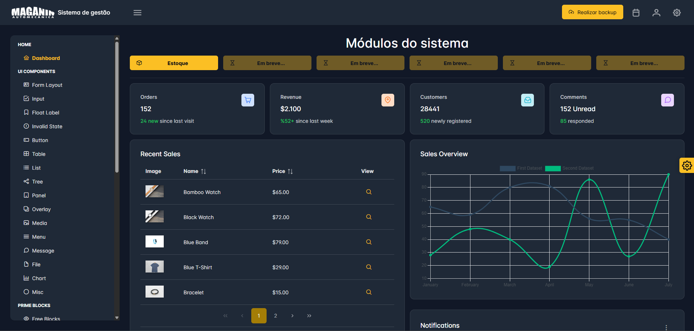

# ERP-MAGANIN-AUTOMECÂNICA

Empoderando decisões de negócios baseadas em dados com inovação.


---

### Construído com este conjunto de tecnologias:


---

## 📑 Índice

- [Visão Geral]
- [Começando]
- [Rodando o projeto]
- [Licensa]
- [Contribuição]
- [Contrato]

---

## 📌 Visão Geral

O **ERP-Maganin-Automêcanica** é um sistema ERP completo focado na oficina automotiva Maganin Automecânica, visando entregar uma gestão integrada de **estoque, finanças, vendas**. Até o momento, somente a primeira versão contendo o módulo de **estoque** foi entregue.

### 🔑 Principais Recursos

- **Gestão de estoque**: Organização do estoque para calcular o quanto tem de cada produto, cálculo de lucro total e de cada produto, geração de planilhas e filtro por parâmetros. Tudo integrado ao banco de dados da aplicação.  
- **Integração com Google Drive**: Backup do banco de dados pelo Google Drive da empresa.  
- **Arquitetura Modular**: Facilita a expansão e manutenção do sistema. 

---

## 🚀 Começando

### 🔧 Pré-requisitos

Certifique-se de ter instalado:  

- Linguagem de Programação: **TypeScript and Java**  
- Gerenciador de Pacotes: **Npm/Yarn**  
- Container: **Docker**  

---

### ⚙️ Instalação

Clone o repositório:

```
git clone https://github.com/JoaoMaganin/ERP-Maganin-Automecanica
```

Acesse o diretório do projeto
```
cd ERP-Maganin-Automecanica
```

Instalando dependências  e buildando o frontend
```
cd front-erp
npm install
npm run build
cd ..
```

Instalando dependências do backend
```
cd erp
mvn install
```

### 🔧 Configurações adicionais
### 1. Para configurar o **backup**, Configure o Google Cloud Platiform e Ajuste o application.propeties do backend:
  - **Vá para o Google Cloud Platform:** Navegue até "APIs e Serviços" > "Credenciais".
  - **Criar Credenciais:** Clique em "+ CRIAR CREDENCIAIS" e selecione **"ID do cliente OAuth 2.0"**.
  - **Configure a Tela de Consentimento:** Se for a primeira vez, você será solicitado a configurar a "tela de consentimento".
  - **User Type:** Escolha **"Externo"**.
  - **Nome do app:** Coloque um nome (ex: "App de Backup SpringBoot").
  - **E-mail de suporte do usuário:** Seu próprio e-mail.
  - **Dados de contato do desenvolvedor:** Seu e-mail novamente.
  - Clique em "SALVAR E CONTINUAR" nas próximas etapas (Escopos, Usuários de teste). Na tela de usuários de teste, adicione seu próprio endereço @gmail.com.
  - **Crie o ID do Cliente:**
  - Volte para a tela de criação de credenciais.
  - **Tipo de aplicativo:** Selecione **"Aplicativo da Web"**.
  - **Nome:** Dê um nome (ex: "Credenciais Web para Backup").
  - **URIs de redirecionamento autorizados:** Esta é a parte mais importante. É para onde o Google irá te redirecionar após a autorização. Para o processo de autorização local, clique em **"+ ADICIONAR URI"** e insira:
      
      `http://localhost:8080/oauth2/callback`
      
  - **Baixe o JSON:** Após a criação, uma janela pop-up mostrará seu "ID do cliente" e "Chave secreta do cliente". Feche-a e, na lista de credenciais, encontre a que você acabou de criar e clique no **ícone de download (seta para baixo)**. Isso baixará um arquivo chamado `client_secret_....json`.
  - Renomeie este arquivo para `client_secret.json` para facilitar.
  - Coloque-o na pasta `src/main/resources` do seu projeto Spring Boot.
### 2. Os seguintes campos devem ser preenchidos corretamente:
  * google.client-secret.path=classpath:client_secret.json -> é o JSON que foi baixado no passo anterior
  * google.drive.folder-id=id-da-pasta -> é o id que fica depois de '/folders/' na sua url do Google Drive
  * google.credentials-store.path=tokens
  * google.drive.local.sync.path=caminho/da pasta/do drive -> Caminho do drive instalado no seu computador
---
<a id="rodando-projeto"></a>
## ▶️ Rodando o projeto
Na pasta erp, execute o seguinte comando parar dar start no backend:
```
mvn spring-boot:run
```

Para rodar o frontend, na pasta front-erp execute:
```
npm run start
```

E abra o navegador na url:
```
localhost:3000
```
---

## 📜 Licença

Este projeto é open source.  

Isso significa que você pode:  

- ✅ Usar o código livremente em projetos pessoais e comerciais  
- ✅ Modificar e distribuir o código  
- ✅ Incorporar partes em outros softwares  

Desde que você:  

- ⚠️ Inclua o aviso de copyright original  
- ⚠️ Inclua uma cópia desta licença em qualquer distribuição  
---

## 🤝 Contribuição

Contribuições são sempre bem-vindas!  

Para contribuir, siga estas etapas:  

1. Faça um **fork** do projeto  
2. Crie uma branch para sua feature (`git checkout -b feature/minha-feature`)  
3. Faça o commit das suas alterações (`git commit -m 'Adicionando minha feature'`)  
4. Envie para a branch principal (`git push origin feature/minha-feature`)  
5. Abra um **Pull Request**  

---

## 📬 Contato

Se tiver dúvidas, sugestões ou quiser colaborar com o projeto, entre em contato:  

**👤 Nome:** João Vitor Montemór Maganin
**🌐 GitHub:** [JoaoMaganin](https://github.com/JoaoMaganin)  
**💼 LinkedIn:** [João Vitor Montemór Maganin](https://www.linkedin.com/in/joaomaganin)  

---


